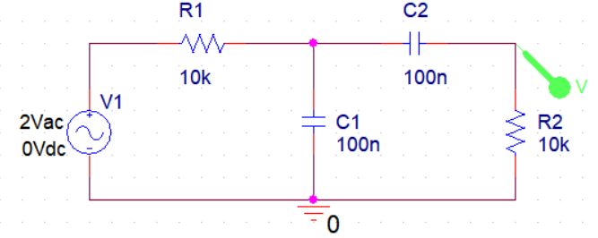
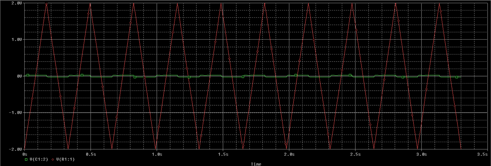

# Frequency Response of Low Pass RC Circuit

Investigation of amplitude response and phase response characteristics in low-pass and intermediate-pass RC circuits.

---

## Question 1:

---

## Question 2:

---

## Question 3:

