# Ohm's and Kirchhoff's Circuit Laws

Investigating Ohm's law, Kirchhoff's voltage and current laws, voltage division and current division laws.

---

## Question 1:

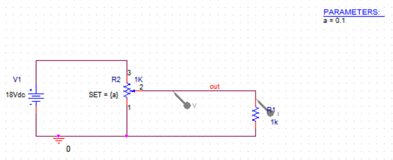

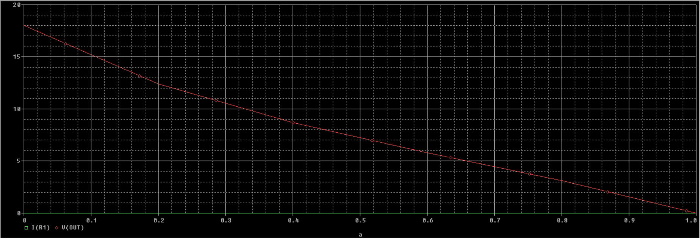
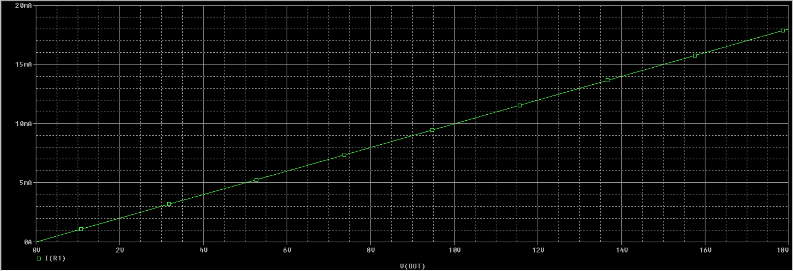

---

## Question 2:

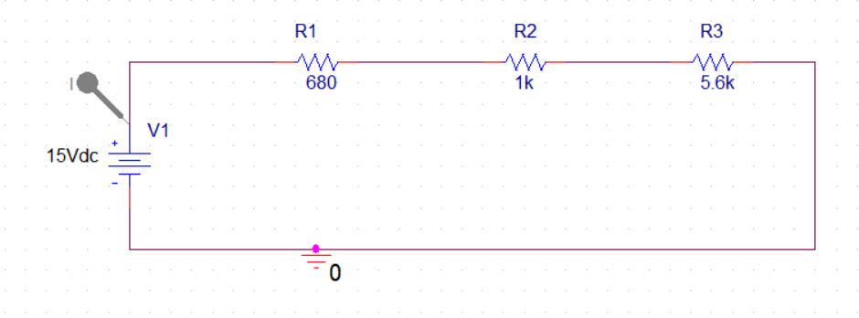
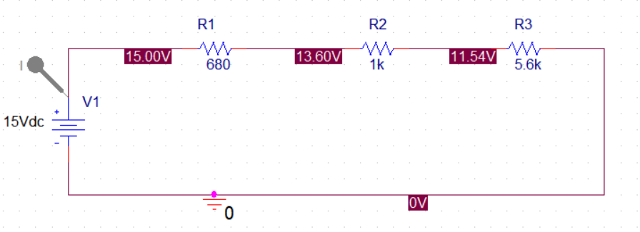
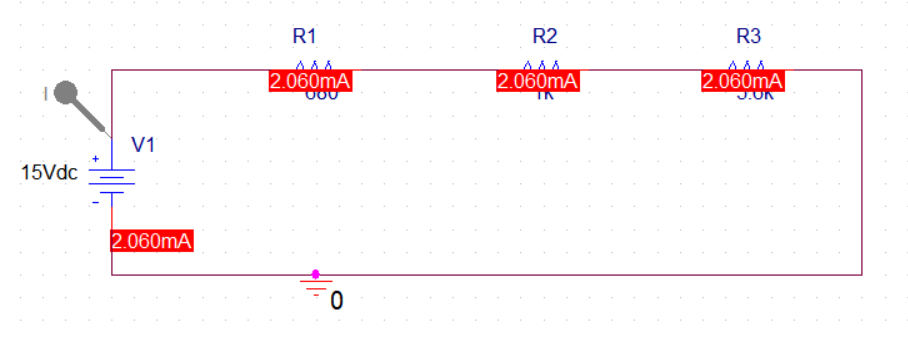

---

## Question 3:

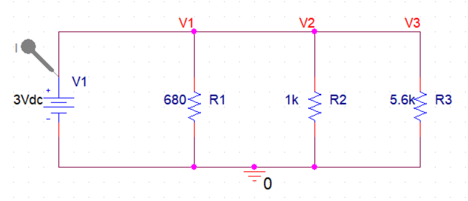
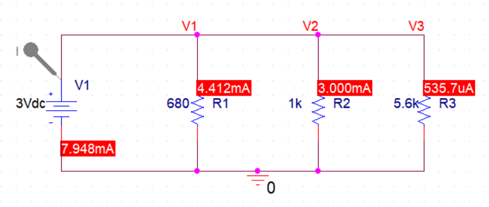

---

## Question 4:

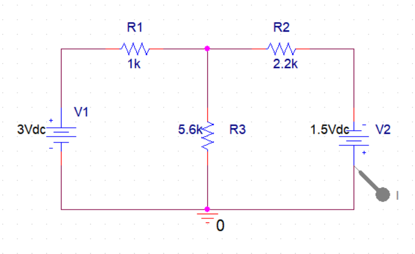
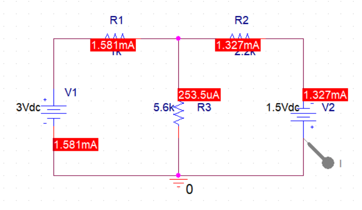
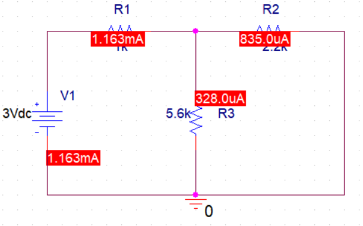
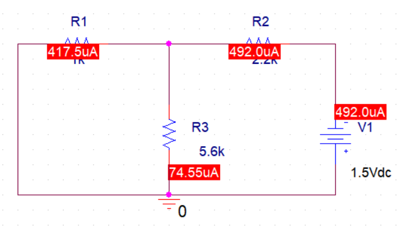
