# Linear applications of the operational amplifier

Investigation of inverting and non-inverting amplifiers and frequency response of low-pass RC circuit using Op-Amps.

---

## Question 1:

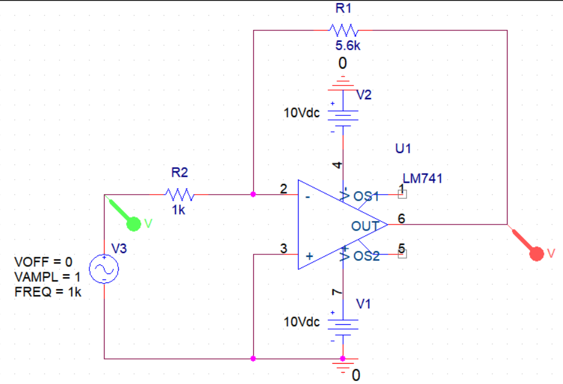
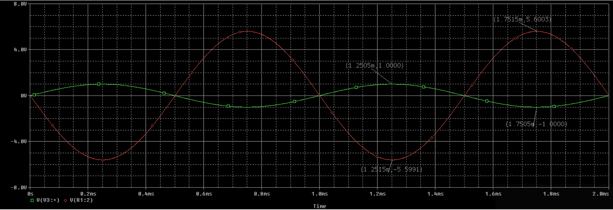

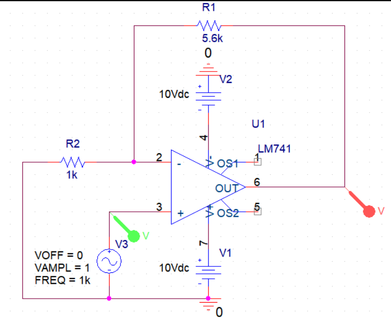
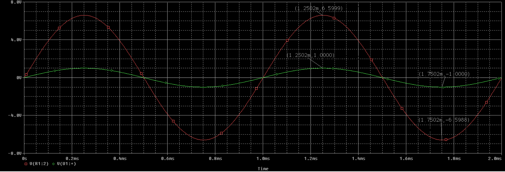

---

## Question 2:

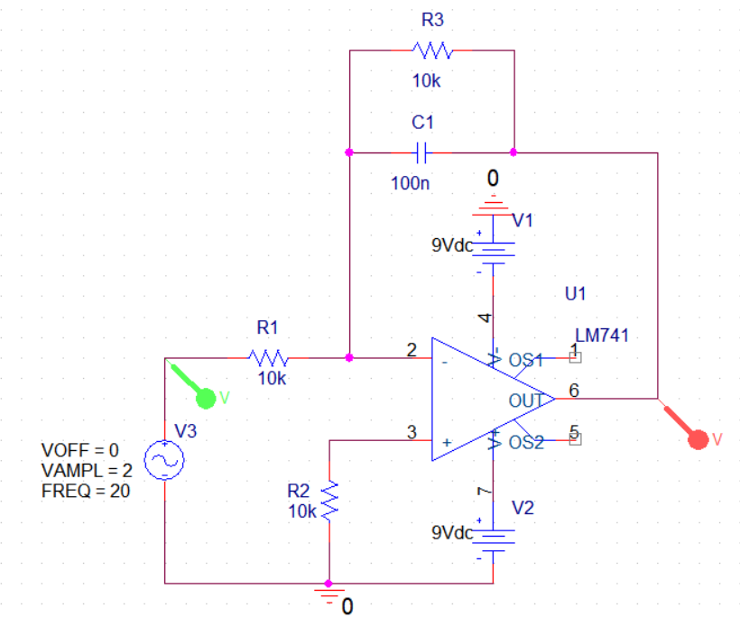
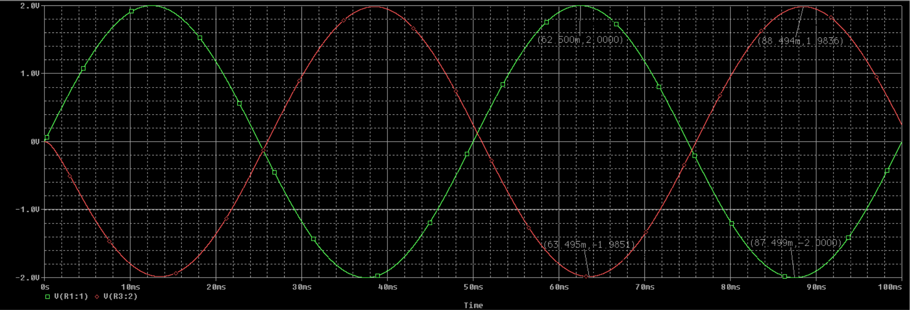
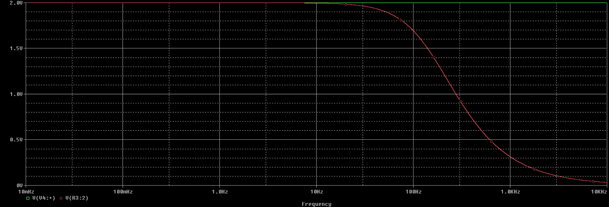
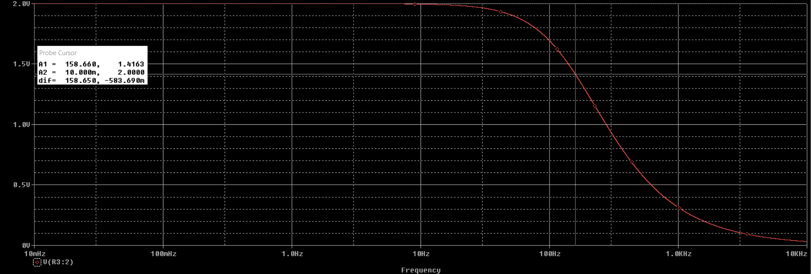
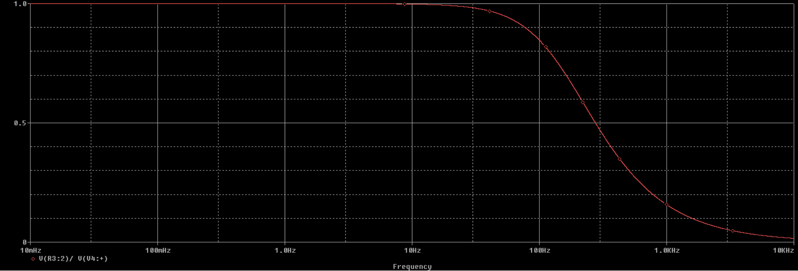
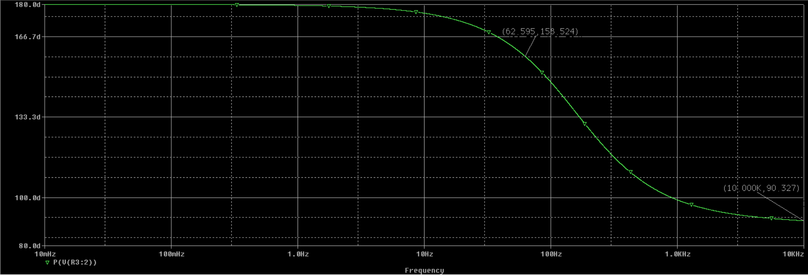

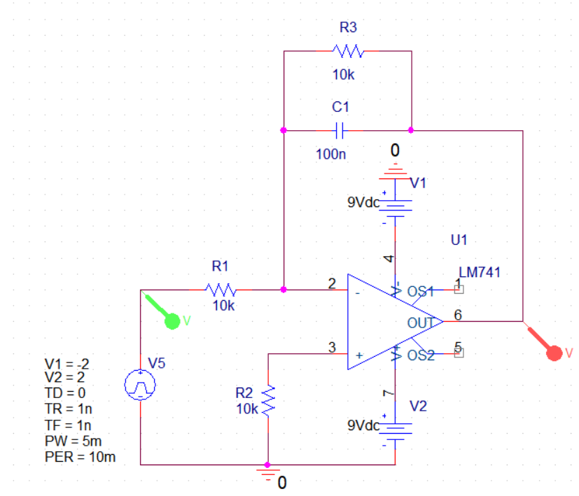
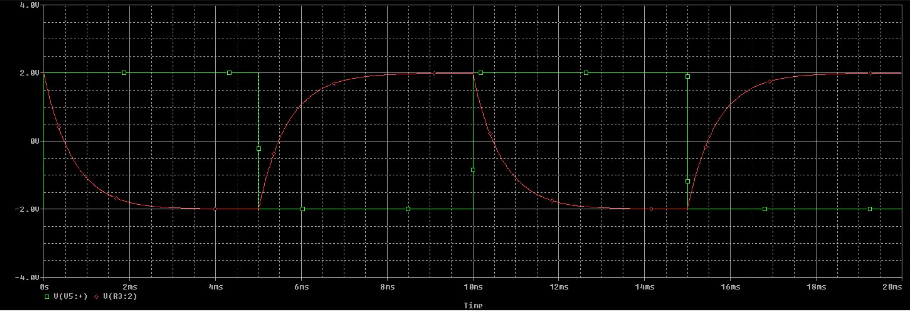
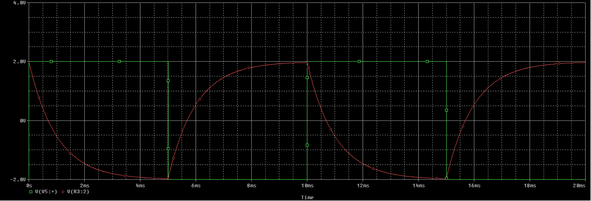
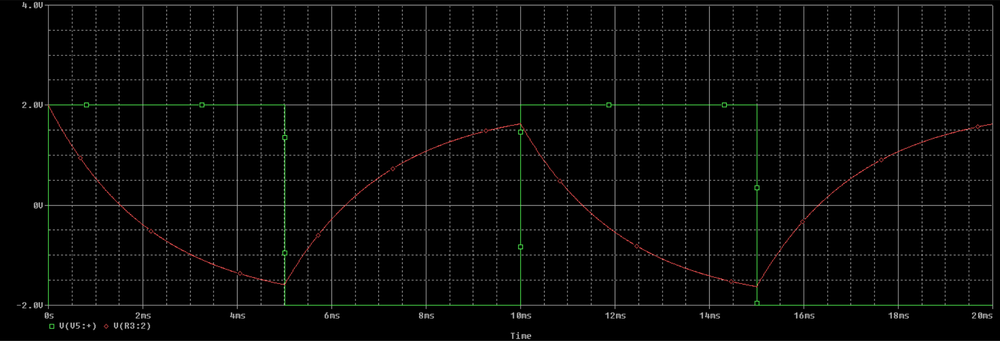
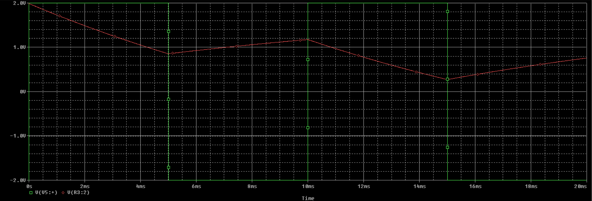
