# Transient Response of RL and RC Circuits

Investigating the transient response of RL and RC circuits to the step input.

---

## Question 1:

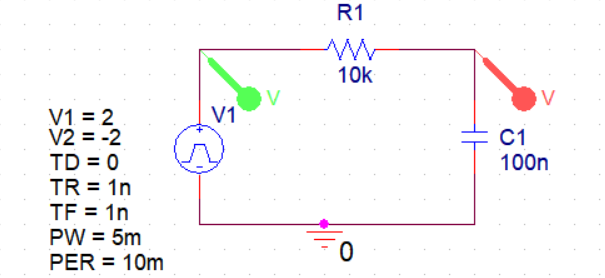

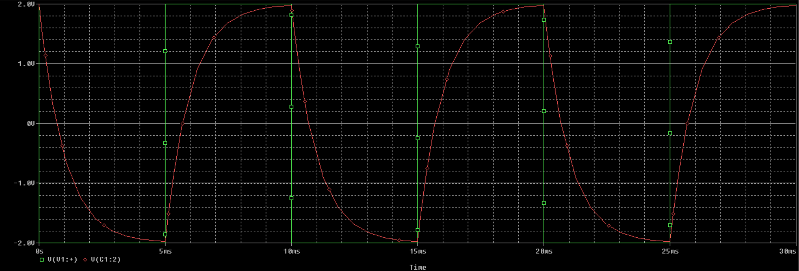

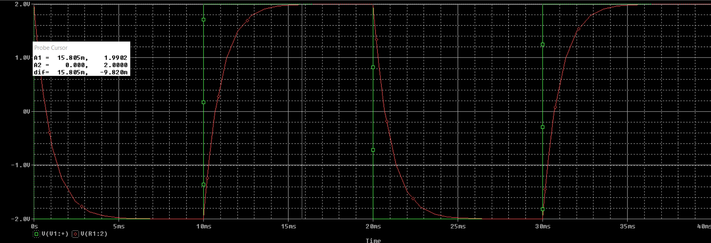
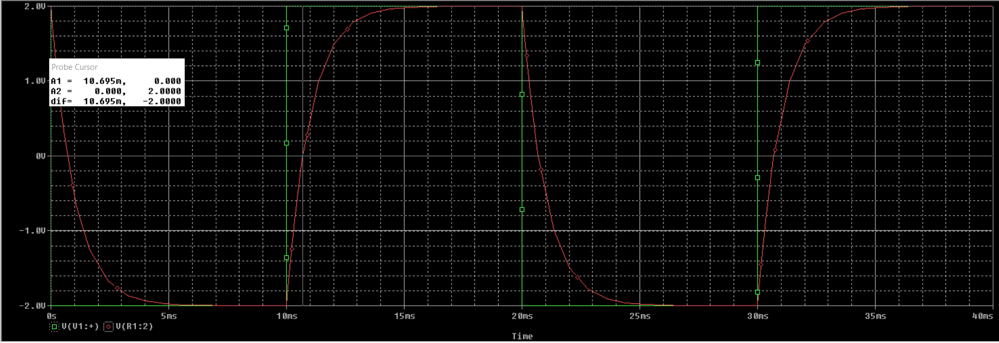

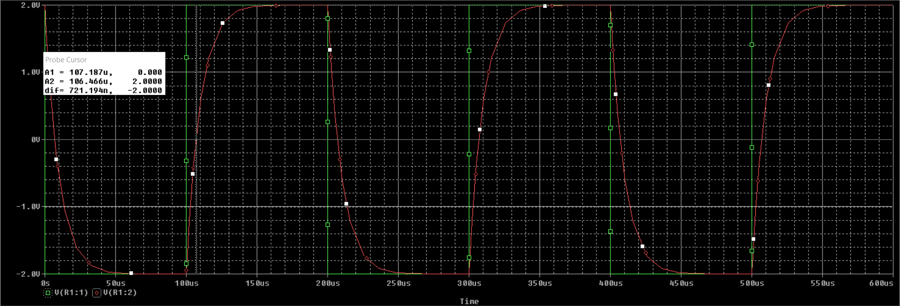
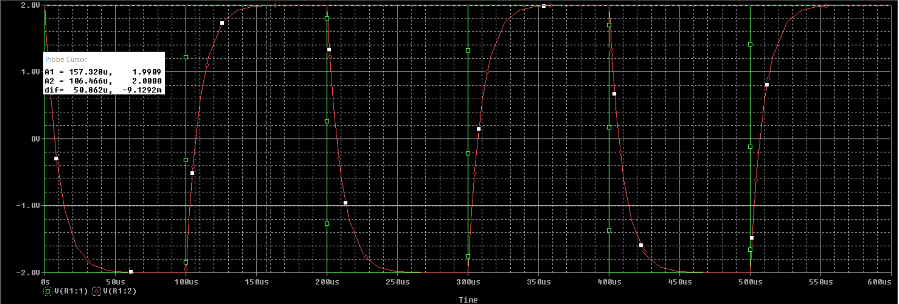

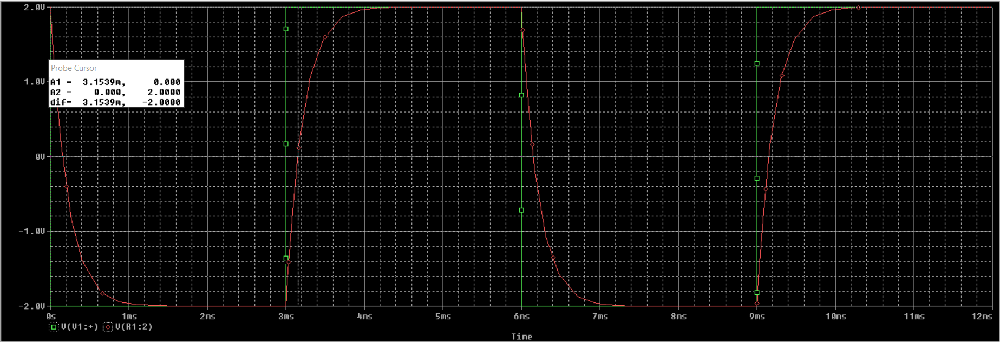
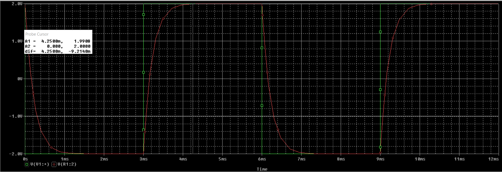

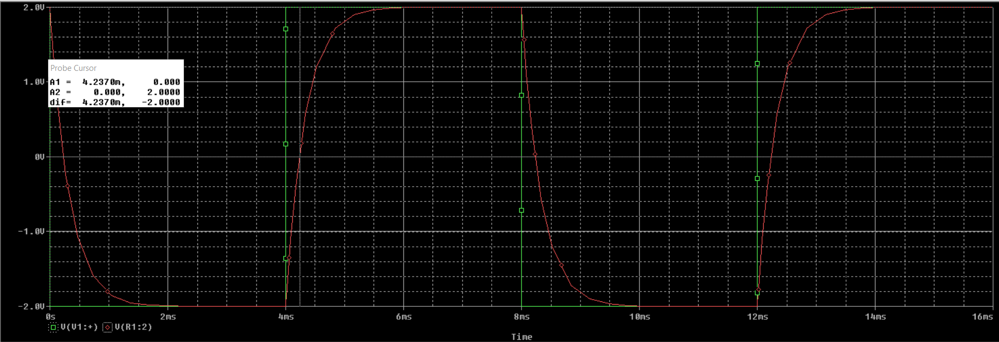
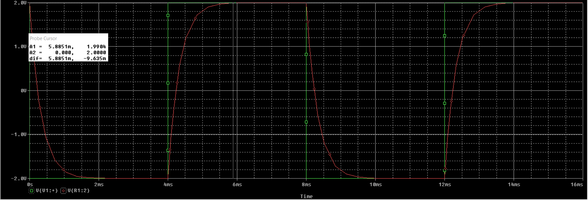

-

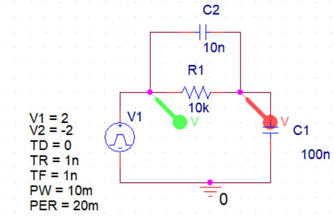

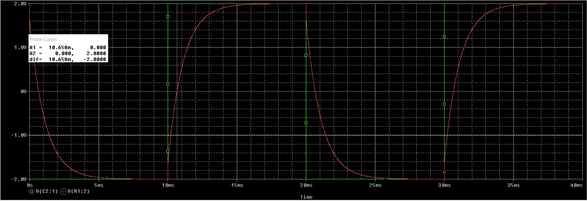
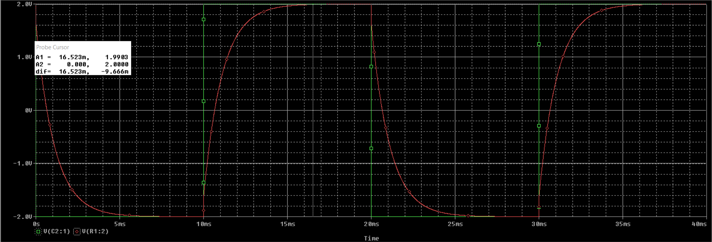

---

## Question 2:

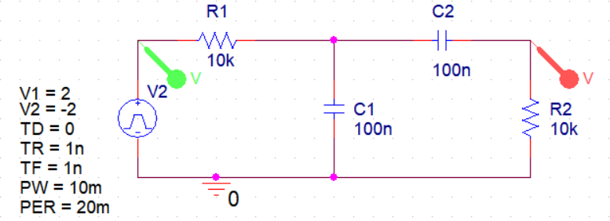

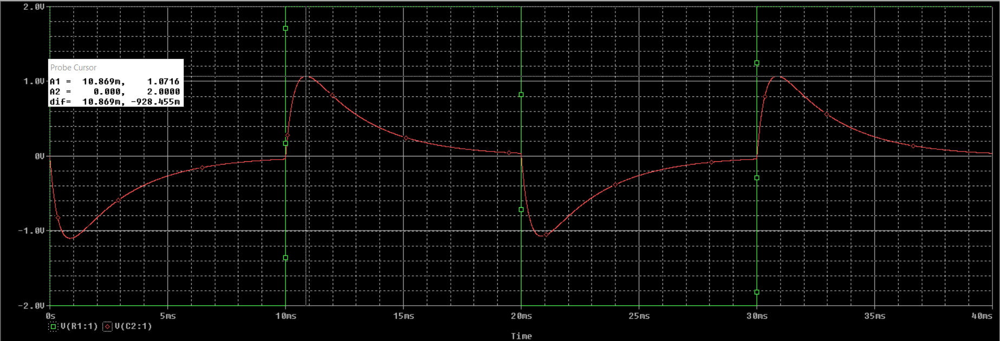

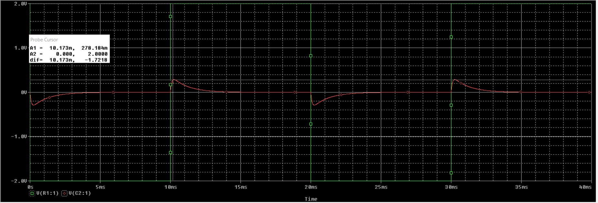

---

## Question 3:

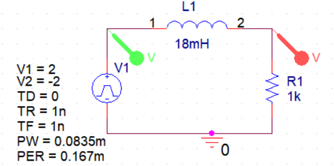

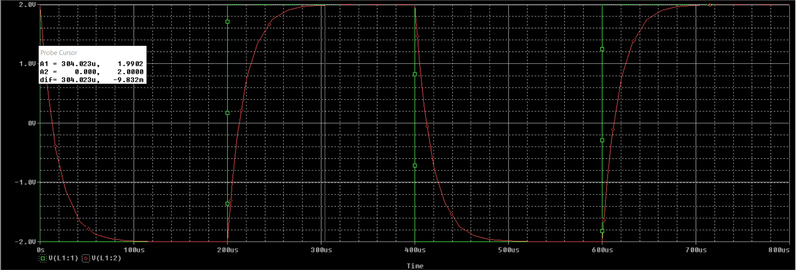

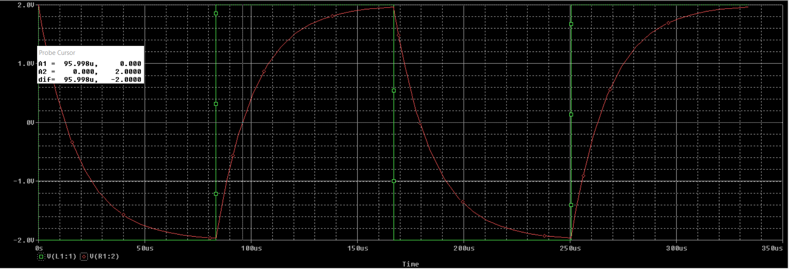
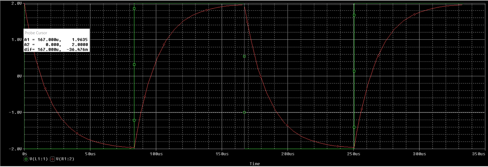

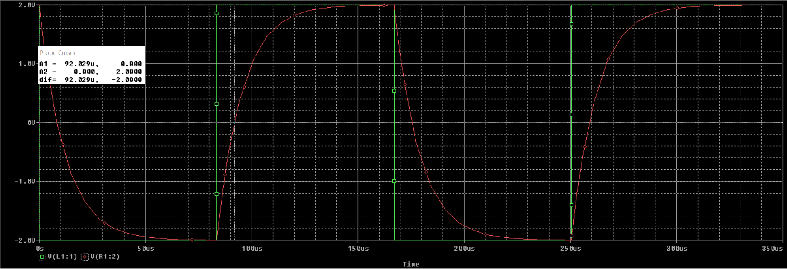
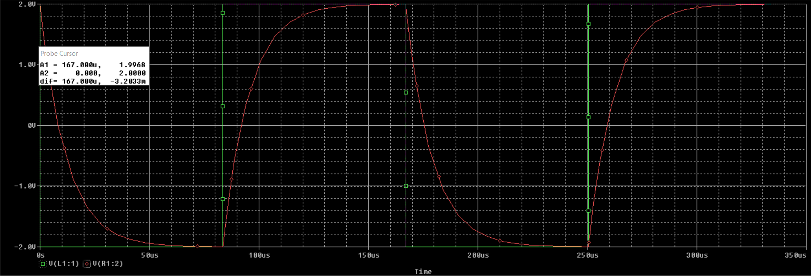
