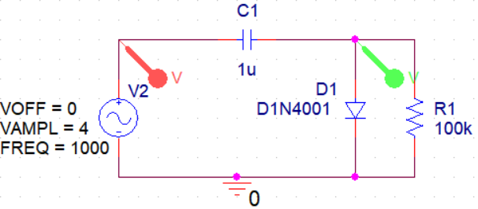

# Familiarity with the Characteristics of Semiconductor Diodes and Diode Application Circuits

In this test, we will get to know the characteristics of 1N4001 diode as well as different circuit designs and general applications of diodes. These designs can be used in various electronic projects.

---

## Question 1:

---

## Question 2:

---

## Question 3:

