# Examining the Thevenin and Norton Equivalent Circuit

Investigating the Thevenin and Norton equivalent circuit and the theorem of maximum power transmission.

---

## Question 1:

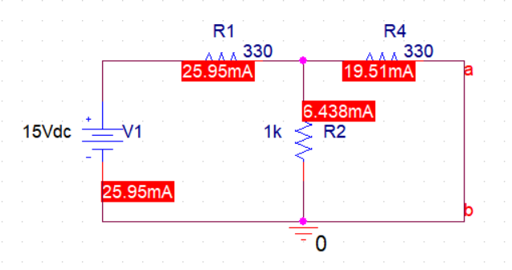

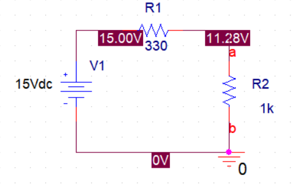

---

## Question 2:

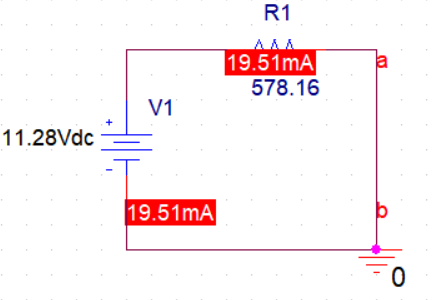

---

## Question 3:

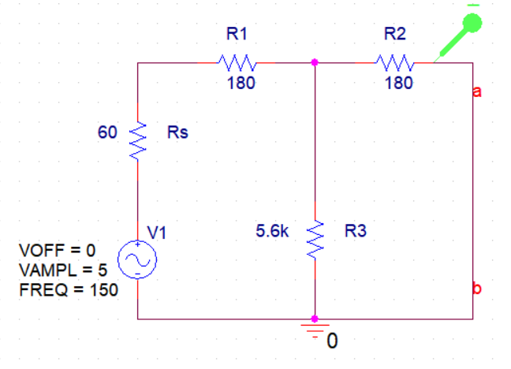
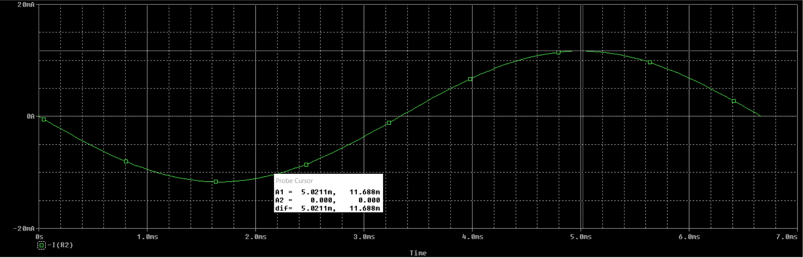

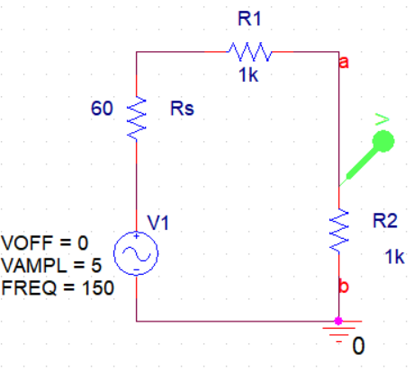
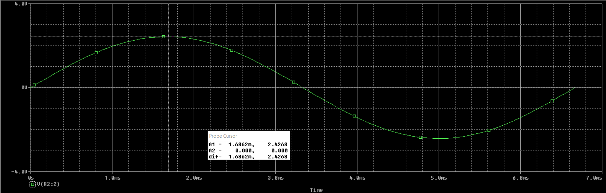

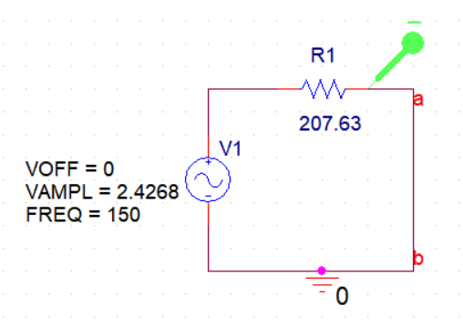
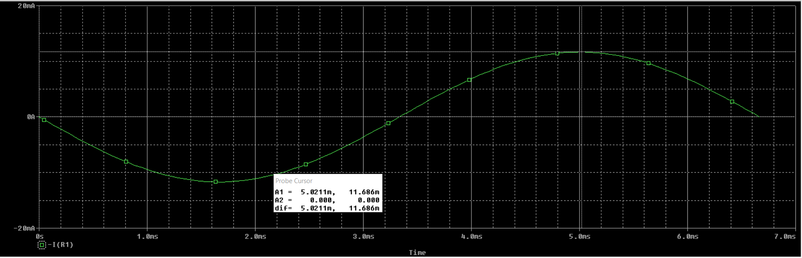

---

## Question 4:

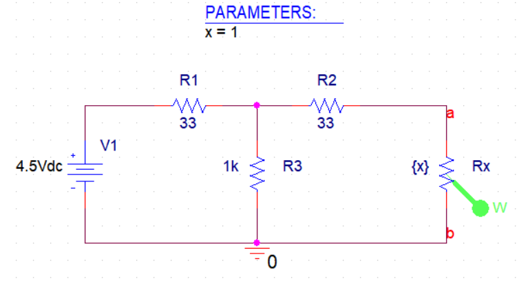
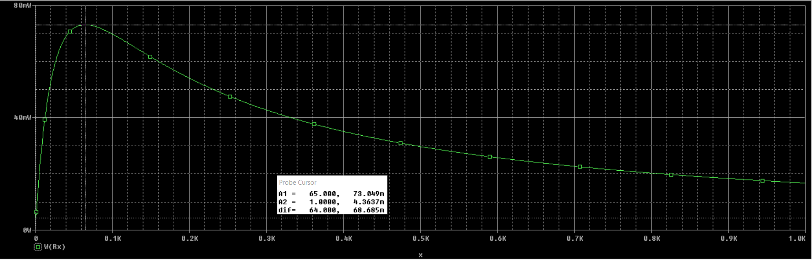
