# Transient Response Series RLC Circuit

Investigating the transient response of the series RLC circuit to the step input.

---

## Question 1:

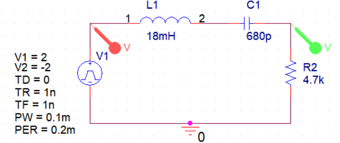

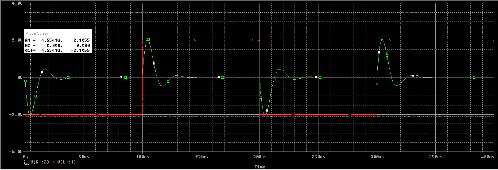
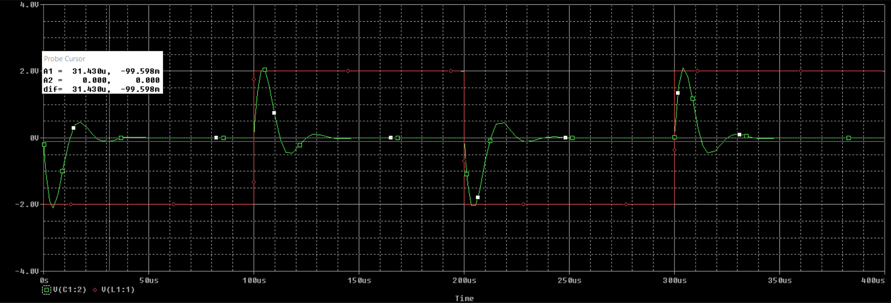

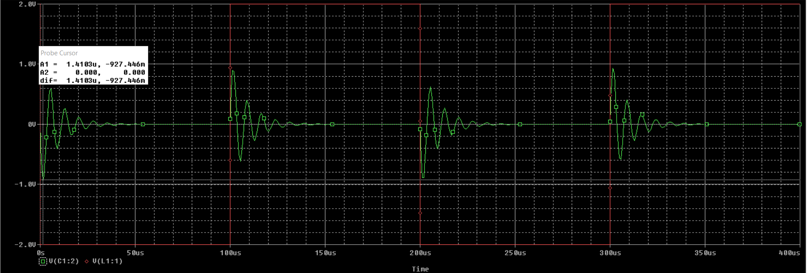
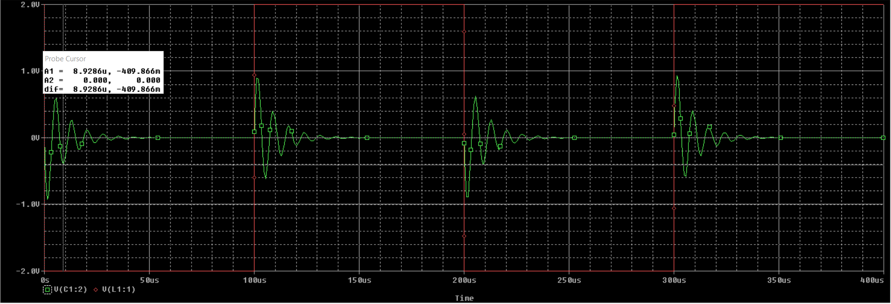

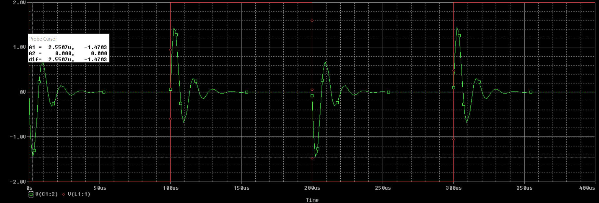
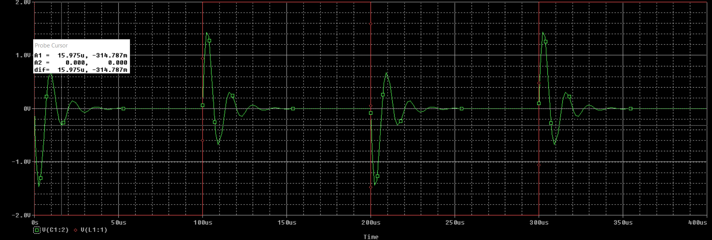

---

## Question 2:

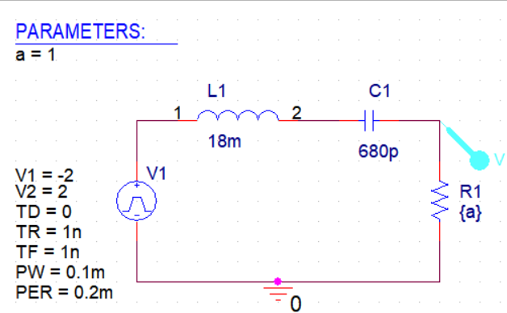

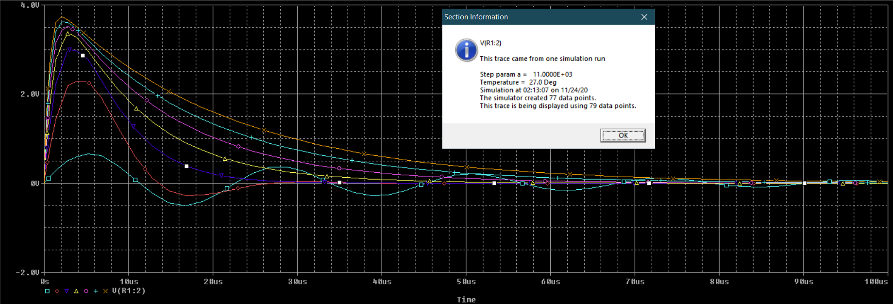
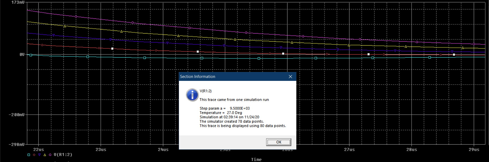
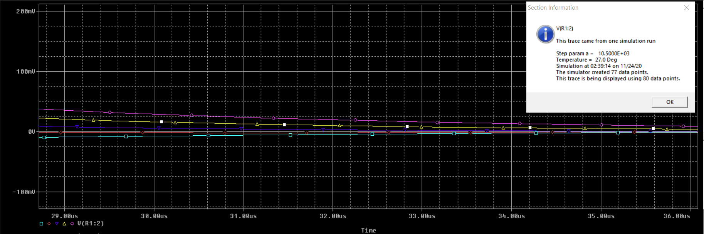

---

## Question 3:

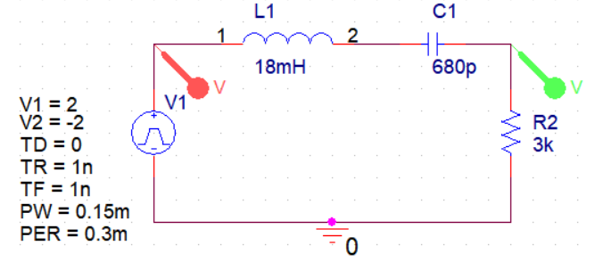

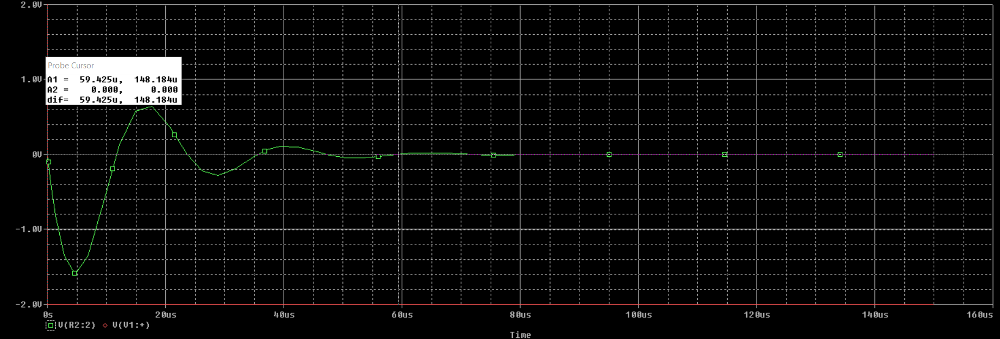

---

## Question 4:

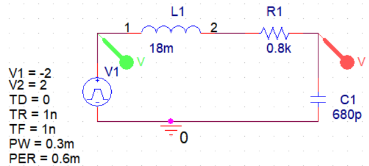

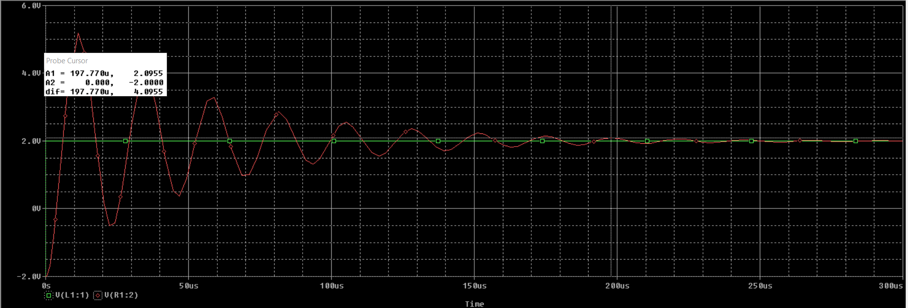
